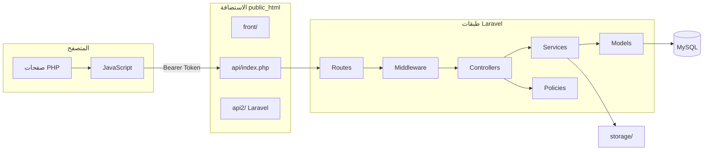
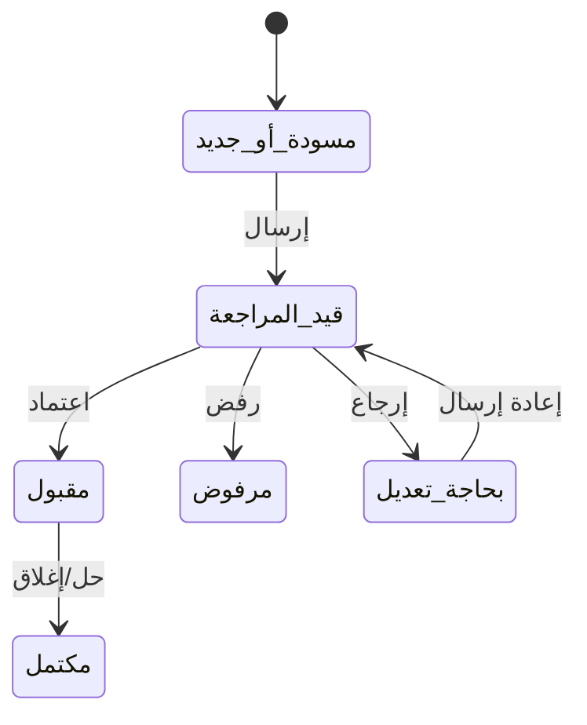
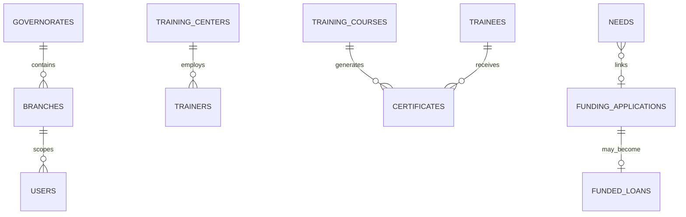
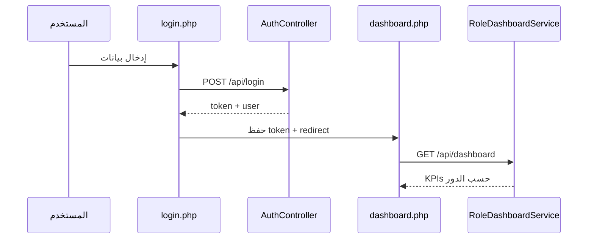
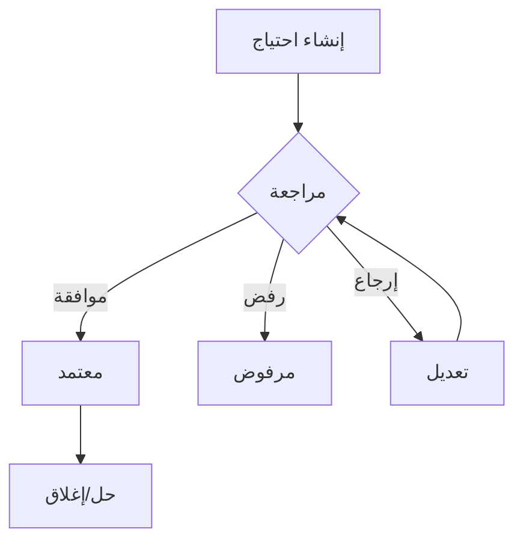

# مواصفات متطلبات البرمجيات
# Software Requirements Specification (SRS)

## منصة هيئة تنمية المشروعات الصغيرة والمتوسطة (SMEDC)

---

| البند | القيمة |
|-------|--------|
| **رقم الوثيقة** | SRS-SMEDC-2026-002 |
| **الإصدار** | 2.0 |
| **الحالة** | للمراجعة والاعتماد |
| **التاريخ** | 2026-07-12 |
| **اللغة** | العربية (RTL) — مصطلحات تقنية بالإنجليزية بين قوسين |
| **المرجع** | IEEE 29148 (أسلوب متوافق) |
| **نطاق الكود المحلل** | `authority2/front/` + `authority2/api2/` |
| **الوثيقة المرافقة** | `Technical_Analysis_Report_v2.0_ar.md` |

---

## سجل الإصدارات

| الإصدار | التاريخ | الوصف | المؤلف |
|---------|---------|-------|--------|
| 1.0 | 2026-07-11 | مسودة أولية (Laravel 11) | فريق التطوير |
| 2.0 | 2026-07-12 | تحليل شامل مبني على الكود الفعلي — Laravel 12 | تحليل تقني |

---

## جدول المحتويات

1. الملخص التنفيذي
2. مقدمة النظام
3. نطاق النظام
4. التعريفات والاختصارات
5. أصحاب المصلحة وأنواع المستخدمين
6. بنية النظام
7. الأدوار والصلاحيات
8. الوحدات الوظيفية
9. حالات الاستخدام (Use Cases)
10. المتطلبات الوظيفية (FR)
11. المتطلبات غير الوظيفية (NFR)
12. قاعدة البيانات
13. واجهات البرمجة (API)
14. تحليل الواجهات
15. سير العمليات (Workflows)
16. الإشعارات
17. المرفقات والملفات
18. التقارير والطباعة
19. الاختبارات
20. المشكلات والفجوات
21. مصفوفة التتبع (RTM)
22. معايير القبول
23. خطة المعالجة
24. قائمة جاهزية الإطلاق
25. الأحكام الختامية

---

# 1. الملخص التنفيذي

## 1.1 ماذا يقدم النظام؟

منصة ويب مركزية تقدم للهيئة وللمستفيدين خدمات رقمية متكاملة:

- **التدريب والتأهيل:** مراكز، مدربون، متدربون، دورات، حقائب، شهادات، طلبات تسجيل.
- **الاحتياجات الجغرافية (GIS):** تسجيل احتياجات، خريطة تفاعلية، سير اعتماد متعدد المستويات.
- **التمويل:** طلبات تمويل، مكاتب استشارية، شركاء تمويل، قروض، مؤشرات.
- **الاستشارات:** سوق مكاتب استشارية وطلبات وعقود.
- **الحاضنات ورواد الأعمال:** برامج حاضنة، ملفات رائد أعمال، قصص نجاح.
- **الإدارة الوطنية:** فروع، محافظات، اتفاقيات، سجلات مالية، مستخدمون، تدقيق.

## 1.2 الوحدات الأساسية

11 وحدة خدمية + 4 وحدات داعمة (مصادقة، إشعارات، رسائل، تدقيق) — انظر القسم 8.

## 1.3 مستوى الجاهزية

| الحالة | التفصيل |
|--------|---------|
| **الإطلاق التجريبي (Pilot)** | ✅ ممكن بعد migrate/seed واختبار أدوار |
| **الإطلاق العام** | ❌ يحتاج CAPTCHA، SMTP، اختبار قبول، إصلاح فجوات UI |

## 1.4 التقييم الرقمي

| المحور | /10 | المبرر المختصر |
|--------|-----|----------------|
| اكتمال الوظائف | 7.0 | وحدات أساسية مكتملة؛ consulting/incubation/workforce جزئية |
| الأمان | 7.0 | RBAC + Policies؛ فجوات auth-only وأسرار template |
| جودة الكود | 6.5 | Services جيدة؛ تكرار inline JS |
| الصلاحيات | 7.5 | 165 صلاحية؛ تطبيق متعدد الطبقات |
| تجربة المستخدم | 6.5 | RTL جيد؛ قوائم مزدوجة؛ أزرار مخفية |
| قاعدة البيانات | 8.0 | مخطط ناضج مع فهارس |
| الأداء | 7.0 | Pagination؛ لا Queue |
| الاختبارات | 6.0 | 29 Feature Test؛ CI غير مكتمل |
| التوثيق | 6.0 | يُحدَّث بهذه الوثيقة |
| جاهزية النشر | 7.0 | Hostinger جاهز |

---

# 2. مقدمة النظام

## 2.1 الغرض من الوثيقة

تحديد المتطلبات الوظيفية وغير الوظيفية **كما هي منفذة فعليًا** في الكود، لتكون مرجعًا للتطوير، الاختبار، الأمن، والتسليم الحكومي.

## 2.2 وصف المنتج

| البند | القيمة | الدليل |
|-------|--------|--------|
| اسم المنتج | SMEDC Platform | `composer.json`, `APP_NAME` |
| نوع النظام | بوابة خدمات + إدارة داخلية | بنية `front/` + `api2/` |
| الإطار | Laravel **12** | `composer.json:12` |
| PHP | ^8.2 | `composer.json:9` |
| قاعدة البيانات | MySQL | `.env.example` |
| المصادقة | Sanctum Token | `AuthController`, `config/sanctum.php` |
| الصلاحيات | Spatie RBAC | `RolePermissionSeeder.php` |

## 2.3 الفئة المستهدفة للوثيقة

- إدارة الهيئة / الجهة الحكومية
- فريق التطوير (Backend + Frontend)
- فريق ضمان الجودة (QA)
- فريق الأمن والتدقيق
- عمليات النشر (DevOps)

---

# 3. نطاق النظام

## 3.1 داخل النطاق (منفذ)

- تسجيل الدخول والتسجيل العام
- إدارة المستخدمين والأدوار والصلاحيات
- التدريب الكامل وسلسلة الشهادات
- الاحتياجات والخريطة
- التمويل المؤسسي
- سوق الاستشارات
- الحاضنات وملفات رواد الأعمال
- الإشعارات والرسائل الداخلية
- التقارير والطباعة (PDF، QR)
- عزل الفروع والمحافظات

## 3.2 خارج النطاق / غير مؤكد

- تطبيق موبايل أصلي — **غير موجود**
- PWA رسمي — **غير مؤكد من الكود**
- WebSocket للإشعارات — **غير منفذ** (polling فقط)
- Redis/Queue في الإنتاج — **غير مفعّل** افتراضيًا

---

# 4. التعريفات والاختصارات

| المصطلح | التعريف |
|---------|---------|
| RBAC | التحكم بالوصول المعتمد على الأدوار (Role-Based Access Control) |
| IDOR | الوصول المباشر غير الآمن للكائنات (Insecure Direct Object Reference) |
| Scope | نطاق البيانات الجغرافي/المؤسسي (وطني، محافظة، فرع) |
| Sanctum | حزمة مصادقة Laravel للـ API Tokens |
| Policy | قواعد تفويض على مستوى النموذج في Laravel |
| Status History | سجل تغييرات الحالة في `status_histories` |
| Front | مجلد الواجهة PHP: `authority2/front/` |
| API2 | نواة Laravel: `authority2/api2/` |

---

# 5. أصحاب المصلحة وأنواع المستخدمين

## 5.1 أصحاب المصلحة

| الجهة | الدور في النظام |
|-------|-----------------|
| الهيئة المركزية | إدارة وطنية، اعتمادات عليا، تقارير |
| فروع المحافظات | تشغيل محلي، عزل بيانات |
| المراكز التدريبية | إدارة دورات ومتدربين |
| المدربون / المتدربون | خدمات ذاتية |
| رواد الأعمال | استبيان وملف رائد أعمال |
| المؤسسات التمويلية | قرارات تمويل |
| المكاتب الاستشارية | دراسات جدوى |
| الجمهور / الزائر | تصفح عام، تسجيل احتياج ضيف |

## 5.2 نقاط الدخول وإعادة التوجيه

| المستخدم | نقطة الدخول | بعد تسجيل الدخول | الدليل |
|----------|-------------|-------------------|--------|
| جميع المسجلين | `login.php` | `dashboard.php` | `login.js` → token → `dashboard.php` |
| الزائر | `index.php` | — | `front/index.php` |
| التسجيل | `register.php` | حسب نوع الحساب | `AuthController@register` |

**لوحة الدور:** `RoleDashboardService::forUser()` — `api2/app/Services/Dashboard/RoleDashboardService.php:46-80` يحدد `dashboard_role` و KPIs حسب الدور.

---

# 6. بنية النظام

## 6.1 المخطط المعماري

## 6.2 طبقات الأمان

1. **Route Middleware** — Spatie `permission` / `role` — `routes/api.php`
2. **Controller authorize()** — استدعاء Policies
3. **Policy** — 28 ملف — `app/Policies/`
4. **Data Scope** — `TrainingDataScope`, `NeedDataScope`, `FinanceDataScope`
5. **Frontend UI** — `data-permission` — `access-control.js` (طبقة عرض فقط)

---

# 7. الأدوار والصلاحيات

## 7.1 مصدر الحقيقة

`api2/database/seeders/RolePermissionSeeder.php` — 32 دور، 165 صلاحية، guard `sanctum`.

## 7.2 جدول الأدوار المختصر

| الدور | الوصف | نطاق البيانات | مصدر |
|-------|-------|---------------|------|
| `general_director` | المدير العام | وطني كامل | Seeder:418 |
| `deputy_general_director` | نائب المدير العام | وطني كامل | Seeder:421 |
| `deputy_director` | نائب مدير | وطني كامل | Seeder:511 |
| `admin` / `super_admin` | إدارة عليا | وطني كامل | Seeder:419,631 |
| `branch_manager` | مدير فرع | فرع واحد | Seeder:431 + `BranchDataScope` |
| `branch_officer` | موظف فرع | فرع — قراءة/إنشاء محدود | Seeder:444 |
| `governor` | محافظ | محافظة | Seeder:423 |
| `training_manager` | مدير تدريب | حسب `TrainingDataScope` | Seeder:448 |
| `training_supervisor` | جهة مشرفة | حسب `training_supervisor_id` | Seeder:490 |
| `trainer_user` | مدرب | بياناته ودوراته | Seeder:538 |
| `trainee_user` | متدرب | بياناته | Seeder:554 |
| `data_entry` | إدخال احتياجات | فرع/محافظة | Seeder:582 |
| `data_reviewer` | مراجعة احتياجات | فرع | Seeder:583 |
| `finance_manager` | مدير تمويل | وطني تمويل | Seeder:415 |
| `project_owner` | رائد أعمال | طلباته | Seeder:589 |
| `consultant_office` | مكتب استشاري تمويل | تعييناته | Seeder:591 |
| `auditor` | مدقق | قراءة فقط | Seeder:560 |
| `system_admin` | مدير نظام | إدارة وصول | Seeder:633 |

*الجدول الكامل لـ 32 دور في الملحق أ — التقرير الفني القسم 3.*

## 7.3 مصفوفة صلاحيات مختصرة (أمثلة)

| العملية | Admin | General Director | Branch Manager | Data Entry | Trainer | Auditor |
|---------|:-----:|:----------------:|:--------------:|:----------:|:-------:|:-------:|
| عرض احتياجات الفرع | ✓ | ✓ | ✓ | ✓ | — | ✓ |
| إنشاء احتياج | ✓ | ✓ | ✓ | ✓ | — | — |
| اعتماد احتياج | ✓ | ✓ | ✓ | — | — | — |
| إدارة دورات | ✓ | ✓ | ✓ | — | — | — |
| إصدار شهادة | ✓ | ✓ | ✓ | — | — | — |
| إدارة مستخدمين | ✓* | ✓* | — | — | — | — |
| عرض سجل تدقيق | ✓ | ✓ | — | — | — | ✓ |

*`*` عبر `system_admin` أو أدوار Tier A مع `view_users` / `manage_user_access`.*

## 7.4 تقييم تطبيق الصلاحيات

| السؤال | الجواب | الدليل |
|--------|--------|--------|
| هل مطبقة في الباك إند؟ | **نعم جزئيًا** | Policies + Middleware |
| هل الاعتماد على إخفاء الأزرار فقط؟ | **لا** — طبقة إضافية | `access-control.js` + Policies |
| هل يمكن تجاوزها عبر API؟ | **يُمنع في المسارات المحمية** | اختبارات `BranchIsolationTest` |
| تعارض UI/Backend؟ | **موجود في حالات** | أزرار `d-none`؛ مسارات auth-only |
| أدوار بلا صلاحيات؟ | **لا** — كل دور له مجموعة في Seeder |
| صلاحيات بلا أدوار scoped؟ | **3 صلاحيات** بلا فحص كود | تقرير فني 3.2 |

---

# 8. الوحدات الوظيفية

## 8.1 وحدة المصادقة (AUTH)

| البند | التفصيل |
|-------|---------|
| **الهدف** | تسجيل مستخدمين ومصادقة API |
| **الصفحات** | `login.php`, `register.php`, `403.php` |
| **API** | `POST /api/login`, `/api/register`, `/api/logout`, `GET /api/me` |
| **Controller** | `app/Http/Controllers/Api/AuthController.php` |
| **الحالات** | منفذ بالكامل؛ CAPTCHA اختياري `CAPTCHA_ENABLED=false` |
| **قاعدة البيانات** | `users`, `personal_access_tokens` |

### انتقالات الحالة — المستخدم

| الحالة | الإجراء | الحالة التالية | الدور |
|--------|---------|----------------|-------|
| `is_active=true` | تعطيل | `is_active=false` | `manage_user_access` |
| `is_active=false` | تفعيل | `is_active=true` | `manage_user_access` |

---

## 8.2 وحدة الاحتياجات GIS (NEEDS)

| البند | التفصيل |
|-------|---------|
| **الهدف** | تسجيل واحتياجات المشاريع على خريطة مع سير اعتماد |
| **الصفحات** | `services/gis/needs-map.php`, `need-create.php`, `needs-list.php`, `needs-dashboard.php`, `need-view.php`, `need-edit.php`, `admin-units.php` |
| **API** | `/api/needs/*`, `/api/public/needs/*` |
| **Controller** | `NeedController.php` |
| **Service** | `NeedWorkflowService.php` — Transactions + `StatusHistoryService` |
| **Policy** | `NeedPolicy.php` |
| **Scope** | `NeedDataScope.php` |
| **الجداول** | `needs`, `need_action_logs`, `need_lookups`, `administrative_units` |

### حالات السجل (`needs.status`)

قيم نصية (string) — الافتراضي `pending_governorate_review` — migration `2026_06_23_100000_create_needs_module_tables.php`.

### دورة العمل (مبسطة)

**الدليل:** `NeedWorkflowService::transition()`؛ `StatusTransitionValidator`؛ `status_histories`.

### قواعد العمل

- منع `auditor` من الإنشاء — `NeedPolicy.php:create`
- احتياج الدولة يتطلب `needs.create_state` — Seeder + Policy
- Fallback عام للخريطة: `needs-map.js` يستدعي `/public/needs/*` عند 403

---

## 8.3 وحدة التدريب (TRN)

| البند | التفصيل |
|-------|---------|
| **الهدف** | إدارة منظومة التدريب من التسجيل حتى الشهادة |
| **الصفحات** | 27 صفحة في `services/training/` |
| **API** | `/api/training-*`, `/api/trainers`, `/api/certificates`, `/api/registration-requests/*` |
| **Scope** | `TrainingDataScope.php` |
| **الجهة المشرفة** | `TrainingSupervisor` — migration `2026_07_11_180000` |

### حالات الشهادة (`certificates.status`)

`draft` → `pending_center` → `pending_training` → `pending_deputy` → `pending_general_director` → `approved` / `rejected` / `cancelled`

**الدليل:** `CertificatePolicy.php`؛ migration `2026_06_22_200100_add_general_director_certificate_approval_step.php`

### حالات الدورة (`training_courses.status`)

`draft`, `scheduled`, `ongoing`, `completed`, `cancelled`

---

## 8.4 وحدة التمويل (FIN)

| البند | التفصيل |
|-------|---------|
| **الهدف** | دورة طلب تمويل من التقديم حتى القرض |
| **الصفحات** | 20 صفحة `services/finance/` |
| **API** | `/api/finance/*` |
| **Service** | `FundingApplicationService.php` |
| **Policy** | `FundingApplicationPolicy.php` |
| **الصلاحيات** | 64 صلاحية `finance.*` |

### حالات طلب التمويل

12 مرحلة — من `draft` إلى `funded` / `defaulted` / `closed` — `FundingApplication` model.

---

## 8.5 وحدة الاستشارات (CON)

| البند | التفصيل |
|-------|---------|
| **الهدف** | سوق استشارات بين طالب خدمة ومكاتب |
| **الصفحات** | 7 صفحات `services/consulting/` — **inline fetch** |
| **API** | `/api/consulting/*` |
| **حالات** | 16 حالة لـ `consulting_requests` — تشمل تحويل لتمويل/تدريب |

**حالة التنفيذ:** منفذ في الباك إند بالكامل؛ الواجهة منفذة جزئيًا (نمط inline).

---

## 8.6 وحدات إضافية (ملخص)

| الوحدة | FR Prefix | الحالة | الدليل |
|--------|-----------|--------|--------|
| الحاضنات | INC | جزئي | `/api/incubation/*` |
| رواد الأعمال | ENT | جزئي | `EntrepreneurProfileController` |
| القوى العاملة | WKF | جزئي | `frontend-gaps.md` — jobs مؤجل |
| الأخبار | NEWS | كامل | `NewsController` |
| الإشعارات | NOT | كامل | `NotificationController` |
| الرسائل | INBOX | كامل | `InboxController` |
| الإدارة | ADM | كامل | `/api/admin/*` |
| التدقيق | AUD | كامل | `audit_logs`, `ActivityLogController` |

---

# 9. حالات الاستخدام (Use Cases)

## UC-001: تسجيل الدخول

| البند | القيمة |
|-------|--------|
| **الممثل** | مستخدم مسجل |
| **الهدف** | الحصول على Token والوصول للخدمات |
| **المتطلبات المسبقة** | حساب `is_active=true` |
| **التدفق** | 1. فتح `login.php` 2. إدخال email/password 3. `POST /api/login` 4. حفظ token 5. توجيه `dashboard.php` |
| **الأخطاء** | 401 بيانات خاطئة؛ 403 حساب معطّل |
| **API** | `AuthController@login` |
| **الجداول** | `users`, `personal_access_tokens` |
| **معيار القبول** | Given بيانات صحيحة When تسجيل دخول Then 200 + token |

## UC-002: إنشاء احتياج

| البند | القيمة |
|-------|--------|
| **الممثل** | `data_entry`, `branch_manager`, `project_owner` |
| **الصلاحيات** | `needs.create` أو `needs.create_citizen` أو `needs.create_state` |
| **التدفق** | `need-create.php` → `POST /api/needs` → `NeedWorkflowService::create` |
| **الجداول** | `needs`, `status_histories` |

## UC-003: اعتماد شهادة متعدد المراحل

| البند | القيمة |
|-------|--------|
| **الممثل** | `center_user` → `training_manager` → `deputy_*` → `general_director` |
| **الصلاحيات** | `approve_center_certificates`, `approve_training_certificates`, `approve_deputy_certificates`, `approve_general_director_certificates` |
| **API** | `CertificateController` + `CertificatePolicy` |
| **الجداول** | `certificates`, `certificate_approvals` |

## UC-004: تقديم طلب تمويل

| الممثل | `project_owner` |
| API | `POST /api/finance/applications` |
| Service | `FundingApplicationService::create` |

*توجد 40+ حالة استخدام إضافية في الملحق ب — نمط UC أعلاه.*

---

# 10. المتطلبات الوظيفية (FR)

| رقم المتطلب | الوحدة | المتطلب | الدور | الأولوية | الحالة | دليل التنفيذ | معيار القبول |
|-------------|--------|---------|-------|----------|--------|--------------|--------------|
| FR-AUTH-001 | مصادقة | يجب أن يصدر النظام Sanctum token عند تسجيل دخول صحيح | الكل | P0 | منفذ | `AuthController@login` | 200 + token |
| FR-AUTH-002 | مصادقة | يجب رفض الحساب المعطّل | الكل | P0 | منفذ | `AuthController` | 403 |
| FR-RBAC-001 | صلاحيات | يجب مزامنة 165 صلاحية عبر Seeder | Admin | P0 | منفذ | `RolePermissionSeeder` | seed ناجح |
| FR-RBAC-002 | صلاحيات | يجب منع مدير الفرع من بيانات فرع آخر | branch_manager | P0 | منفذ | `BranchIsolationTest` | 403 |
| FR-GIS-001 | احتياجات | يجب إنشاء احتياج بكود فريد `need_code` | data_entry+ | P0 | منفذ | `NeedCodeGenerator` + lock | كود فريد |
| FR-GIS-002 | احتياجات | يجب تسجيل تاريخ تغيير الحالة | الكل | P1 | منفذ | `StatusHistoryService` | سجل في DB |
| FR-GIS-003 | احتياجات | يجب عرض خريطة عامة للزائر | زائر | P1 | منفذ | `/api/public/needs/map` | JSON بدون auth |
| FR-TRN-001 | تدريب | يجب ربط المدرب بمركز تدريبي | trainer_user | P0 | منفذ | `Trainer` model FK | علاقة صحيحة |
| FR-TRN-002 | تدريب | يجب تطبيق سير اعتماد شهادة متعدد | معتمدون | P0 | منفذ | `CertificatePolicy` | انتقالات صحيحة |
| FR-FIN-001 | تمويل | يجب منع اعتماد طلب خارج النطاق | finance_manager | P0 | منفذ | `FundingApplicationPolicy` | 403 |
| FR-NOT-001 | إشعارات | يجب عرض عداد غير المقروء | مسجل | P1 | منفذ | `NotificationSummaryService` | polling 60ث |
| FR-ADM-001 | إدارة | يجب تقييد `/api/admin/users` لمديري الوصول | system_admin+ | P0 | منفذ | `$adminAccess` middleware | 403 لغير المصرح |
| FR-SEC-001 | أمان | يجب تطبيق Policy على عرض سجل احتياج | الكل | P0 | منفذ | `NeedPolicy@view` | 403 IDOR |
| FR-UI-001 | واجهة | يجب اكتشاف API URL تلقائيًا على الإنتاج | الكل | P1 | منفذ | `config.js` + `paths.php` | طلبات ناجحة |

*جدول كامل 80+ متطلب في الملحق ج.*

---

# 11. المتطلبات غير الوظيفية (NFR)

| NFR ID | التصنيف | المتطلب | الحالة | الدليل | الفجوة | التوصية |
|--------|---------|---------|--------|--------|--------|---------|
| NFR-SEC-001 | أمان | مصادقة Bearer Token | منفذ | Sanctum | — | — |
| NFR-SEC-002 | أمان | RBAC على المسارات | منفذ جزئيًا | Middleware | بعض auth-only | مراجعة routes |
| NFR-SEC-003 | أمان | Policies لمنع IDOR | منفذ | 28 Policy | — | توسيع الاختبارات |
| NFR-SEC-004 | أمان | Rate Limiting | منفذ | throttle على login/register | — | — |
| NFR-SEC-005 | أمان | CAPTCHA | **غير منفذ** | `CAPTCHA_ENABLED=false` | مفعّل | تفعيل Turnstile |
| NFR-SEC-006 | أمان | CORS مقيد | منفذ | `config/cors.php` | — | ضبط production |
| NFR-SEC-007 | أمان | حماية ملف .env | منفذ | `api2/.htaccess deny` | — | التحقق بعد الرفع |
| NFR-PERF-001 | أداء | Pagination | منفذ | Controllers | — | — |
| NFR-PERF-002 | أداء | فهارس مركبة | منفذ | migrations 2026_06_28 | — | — |
| NFR-PERF-003 | أداء | Cache | جزئي | file cache | لا Redis | حسب الحمل |
| NFR-UX-001 | قابلية استخدام | RTL + عربي | منفذ | `i18n/`, Bootstrap RTL | — | — |
| NFR-UX-002 | قابلية استخدام | تجاوب | منفذ جزئي | Bootstrap | بعض الجداول | اختبار موبايل |
| NFR-REL-001 | اعتمادية | DB Transactions | منفذ | `NeedWorkflowService`, `FundingApplicationService` | — | — |
| NFR-REL-002 | اعتمادية | Status History | منفذ | `status_histories` | ليس كل الكيانات | توسيع |
| NFR-DEP-001 | نشر | PHP 8.2+ | مطلوب | Hostinger README | — | ضبط hPanel |
| NFR-DEP-002 | نشر | Queue Worker | **غير مفعّل** | sync | معالجة متزامنة | Queue للإنتاج |

---

# 12. قاعدة البيانات

## 12.1 الإحصائيات

- **74** migration
- **74** Eloquent model
- **علاقات جغرافية:** `governorates` → `branches` → scoped entities

## 12.2 قاموس بيانات مختصر

| الجدول | الغرض | أهم الحقول | العلاقات |
|--------|-------|------------|----------|
| `users` | مستخدمون | email, branch_id, governorate_id, entity FKs | → branches, centers, trainers |
| `needs` | احتياجات | need_code, status, lat/lng, branch_id | → funding_applications |
| `training_courses` | دورات | course_code, status, center_id, trainer_id | → certificates |
| `certificates` | شهادات | certificate_code, status, security_hash | → approvals |
| `funding_applications` | تمويل | application_number, status | → loans |
| `status_histories` | تدقيق حالات | model_type/id, from/to_status | polymorphic |

## 12.3 مخطط ERD (مختصر)

*ERD كامل في التقرير الفني القسم 6.*

---

# 13. واجهات البرمجة (API)

## 13.1 ملخص

| المقياس | القيمة |
|---------|--------|
| إجمالي endpoints | ~329 |
| عامة | ~27 |
| محمية | ~300 |

## 13.2 جدول مرجعي مختصر

| API ID | Method | Endpoint | Auth | Controller | ربط واجهة |
|--------|--------|----------|------|------------|-----------|
| API-AUTH-01 | POST | `/api/login` | عام | AuthController@login | `login.php` |
| API-AUTH-02 | POST | `/api/register` | عام | AuthController@register | `register.php` |
| API-DASH-01 | GET | `/api/dashboard` | sanctum+dashboard | DashboardController@index | `dashboard.js` |
| API-NEED-01 | GET | `/api/needs` | sanctum+needs.view | NeedController@index | `needs-list.js` |
| API-NEED-02 | POST | `/api/needs` | sanctum+create | NeedController@store | `need-create.js` |
| API-NEED-P01 | GET | `/api/public/needs/map` | عام | PublicBrowseController | `needs-map.js` |
| API-TRN-01 | GET | `/api/training-courses` | sanctum | TrainingCourseController | `training-courses-list.js` |
| API-CERT-01 | POST | `/api/certificates/verify` | عام | CertificateController | `training-verification.js` |
| API-FIN-01 | POST | `/api/finance/applications` | sanctum | FundingApplicationController | `finance-apply.js` |
| API-ADM-01 | GET | `/api/admin/users` | sanctum+admin | UserAccessController | `admin-users.js` |

*المرجع الكامل: `docs/API_Documentation_v1.0.md` — يُحدَّث إلى v2.*

## 13.3 فجوات API

| المشكلة | الدليل |
|---------|--------|
| Endpoints بلا صفحة | بعض admin delegatable — غير مؤكد |
| صفحات بلا endpoint | `frontend-gaps.md` — workforce jobs |
| حقول غير موحدة | غير مؤكد شامل — يتطلب مقارنة حقل بحقل |

---

# 14. تحليل الواجهات

## 14.1 إحصائيات

| المقياس | العدد |
|---------|-------|
| صفحات PHP قابلة للتوجيه | 117 |
| وحدات خدمية | 7 |
| أنظمة تنقل | 2 (dashboard.php sidebar + dashboard-sidebar.php) |

## 14.2 جدول صفحات رئيسية

| الصفحة | المسار | الوحدة | ربط API | الحالة |
|--------|--------|--------|---------|--------|
| الرئيسية | `index.php` | عام | `/api/news` | كامل |
| لوحة التحكم | `dashboard.php` | Core | `/api/dashboard` | كامل |
| خريطة الاحتياجات | `services/gis/needs-map.php` | GIS | `/api/needs/map` + public fallback | كامل |
| إنشاء احتياج | `services/gis/need-create.php` | GIS | `POST /api/needs` | كامل |
| دورات تدريب | `services/training/training-courses-list.php` | TRN | `/api/training-courses` | كامل |
| طلبات تسجيل | `services/training/registration-requests-review.php` | TRN | `/api/registration-requests/*` | كامل |
| تمويل | `services/finance/finance-apply.php` | FIN | `/api/finance/applications` | كامل |
| مستخدمون | `services/admin/admin-users.php` | ADM | `/api/admin/users` | كامل |

## 14.3 مشاكل واجهة مؤكدة

1. مسار `includes/layout/dashboard-sidebar.php` مفقود — program-bank pages
2. ~18 ملف JS يتيم
3. إخفاء `d-none` دون إظهار بعد الصلاحية — مُصلَح لـ `data-any-permission`
4. قوائم جانبية مزدوجة قد تربك المستخدم

---

# 15. سير العمليات (Workflows)

## 15.1 تسجيل الدخول والتوجيه

## 15.2 دورة الاحتياج

## 15.3 دورة الشهادة

مركز → مدير تدريب → نائب → مدير عام — `CertificatePolicy` + `certificate_approvals`.

---

# 16. الإشعارات

| البند | التفصيل | الدليل |
|-------|---------|--------|
| التخزين | جدول `notifications` | migration 2026_06_19 |
| القنوات | داخل النظام فقط | لا Push؛ MAIL=log |
| القراءة | `is_read` + API | `NotificationController` |
| العداد | polling 60 ثانية | `notifications.js` |
| الملخص | `NotificationSummaryService` | unread count |

| الحدث | المستلم | القناة | الحالة |
|-------|---------|--------|--------|
| تغيير حالة طلب | صاحب الطلب | in-app | منفذ |
| رسالة inbox | المستهدف | in-app | منفذ |
| بريد إلكتروني | — | email | **غير منفذ** |

---

# 17. المرفقات والملفات

| البند | التفصيل | الدليل |
|-------|---------|--------|
| التخزين | `storage/app` — `FILESYSTEM_DISK=local` | `.env.example` |
| الرابط العام | `php artisan storage:link` | deploy README |
| الرفع | `throttle:file-upload` | routes/api.php |
| PDF | DomPDF | `CertificatePrintController` |
| QR | Simple QrCode + route عام | `routes/web.php:73-75` |
| Signed URLs | طباعة بطاقات/شهادات | `middleware signed` — web.php |

**مخاطر:** الوصول المباشر لـ storage يجب منعه عبر `.htaccess` في `api2/`.

---

# 18. التقارير والطباعة

| النوع | المصدر | المستخدمون | الدليل |
|-------|--------|------------|--------|
| PDF شهادة | `CertificatePrintController` | معتمدون + عام بالكود | `routes/web.php` |
| بطاقة متدرب | `TraineePrintController` | signed URL | web routes |
| تصدير احتياجات | `GET /api/needs/export` | needs.export | `NeedController` |
| تصدير نشاط | `GET /api/admin/activity-logs/export` | view_audit | `ActivityLogController` |
| لوحات KPI | `/api/dashboard` | حسب الدور | `RoleDashboardService` |
| مؤشرات تمويل | `/api/finance/metrics` | finance.* | `FundingMetricsController` |

---

# 19. الاختبارات

## 19.1 ملفات الاختبار (29)

| الاختبار | الوحدة | التغطية |
|----------|--------|---------|
| `BranchIsolationTest` | RBAC/Scope | عزل الفروع |
| `RoleAccessIsolationTest` | RBAC | عزل الأدوار |
| `NeedsModuleTest` | GIS | احتياجات |
| `FundingPlatformTest` | FIN | تمويل |
| `CertificateFullApprovalFlowTest` | TRN | شهادات |
| `SecurityHardeningFixesTest` | SEC | أمان |
| `ProductionLaunchAuditTest` | كلي | جاهزية |

## 19.2 فجوات التغطية

- واجهات PHP/JS — **لا اختبارات E2E**
- consulting/incubation UI — **محدود**
- `php artisan test` — **غير معرّف** في المشروع الحالي

---

# 20. المشكلات والفجوات

| ID | المشكلة | التصنيف | الخطورة | الملف | التوصية |
|----|---------|---------|---------|-------|---------|
| GAP-001 | أسرار في env template | أمان | **حرجة** | `deploy/hostinger/env.production.template` | تدوير |
| GAP-002 | CAPTCHA معطّل | أمان | عالية | env template | تفعيل |
| GAP-003 | MAIL=log | تشغيل | عالية | `.env` | SMTP |
| GAP-004 | sidebar path مكسور | UI | متوسطة | program-bank pages | إصلاح include |
| GAP-005 | JS يتيم | UI | متوسطة | `assets/js/pages/` | ربط أو حذف |
| GAP-006 | أدوار مكررة development | RBAC | متوسطة | RolePermissionSeeder | توحيد |
| GAP-007 | Queue sync | أداء | متوسطة | `.env` | Queue worker |
| GAP-008 | branch_id NULL | بيانات | عالية | users table | إصلاح بيانات |
| GAP-009 | SRS v1 Laravel 11 | توثيق | منخفضة | docs | هذه الوثيقة |
| GAP-010 | لا واجهة إدارة supervisors | وظيفي | متوسطة | TrainingSupervisor | إضافة UI |

---

# 21. مصفوفة التتبع (RTM) — عينة

| FR ID | المتطلب | الواجهة | API | Controller/Service | DB | اختبار | الحالة |
|-------|---------|---------|-----|-------------------|-----|--------|--------|
| FR-AUTH-001 | تسجيل دخول | login.php | POST /api/login | AuthController | users, tokens | غير مؤكد | منفذ |
| FR-GIS-001 | كود احتياج فريد | need-create.php | POST /api/needs | NeedCodeGenerator | needs | NeedsModuleTest | منفذ |
| FR-RBAC-002 | عزل فرع | admin-branches | GET /api/branches/{id} | BranchPolicy | branches | BranchIsolationTest | منفذ |
| FR-TRN-002 | اعتماد شهادة | training-certificates-approve | PUT /api/certificates/{id}/approve-* | CertificatePolicy | certificates | CertificateFullApprovalFlowTest | منفذ |
| FR-NOT-001 | عداد إشعارات | notifications.js | GET /api/notifications/summary | NotificationSummaryService | notifications | غير مؤكد | منفذ |

*RTM كامل 80+ صف في `requirements_traceability_matrix_v2.0_ar.md` — يُنشأ عند الطلب.*

---

# 22. معايير القبول (عينات Given/When/Then)

**AC-RBAC-001**
- **Given** مستخدم بدور `branch_manager` لفرع دمشق
- **When** يطلب `GET /api/trainers` لمدرب في فرع حلب
- **Then** لا يظهر المدرب في النتائج أو 403 عند الوصول المباشر

**AC-GIS-001**
- **Given** مستخدم بصلاحية `needs.create`
- **When** ينشئ احتياجًا من `need-create.php`
- **Then** يُنشأ سجل في `needs` مع `need_code` فريد وسجل في `status_histories`

**AC-CERT-001**
- **Given** شهادة بحالة `pending_center`
- **When** مستخدم بصلاحية `approve_center_certificates` يعتمد
- **Then** تنتقل إلى `pending_training` وتُسجّل في `certificate_approvals`

---

# 23. خطة المعالجة

## المرحلة 1 — حرجة (P0)

| المهمة | السبب | الملفات | معيار الانتهاء |
|--------|-------|---------|----------------|
| تدوير أسرار الإنتاج | تسريب محتمل | env, Hostinger | مفاتيح جديدة |
| إصلاح branch_id | حسابات معطلة | DB users | كل branch_manager له branch |
| اختبار قبول أدوار | Pilot | smoke-test.md | checklist ✓ |

## المرحلة 2 — استكمال (P1)

| المهمة | السبب | الملفات |
|--------|-------|---------|
| تفعيل CAPTCHA + SMTP | إطلاق عام | .env, captcha.js |
| إصلاح sidebar program-bank | UX | program-bank-*.php |
| ربط JS اليتيم | صيانة | front/assets/js/pages |

## المرحلة 3 — جودة (P2)

| المهمة | السبب |
|--------|-------|
| توحيد نمط frontend | صيانة |
| CI + phpunit script | اختبارات |
| Queue worker | أداء |

## المرحلة 4 — إنتاج (P3)

| المهمة |
|--------|
| Monitoring + backup |
| تحديث API docs v2 |
| تدريب مستخدمين |

---

# 24. قائمة جاهزية الإطلاق

| # | البند | الحالة |
|---|-------|--------|
| 1 | Migrations منفذة | ☐ على السيرفر |
| 2 | RolePermissionSeeder | ☐ |
| 3 | storage:link | ☐ |
| 4 | APP_DEBUG=false | ☐ |
| 5 | CORS/SESSION/SANCTUM domains | ☐ |
| 6 | تغيير كلمات مرور @system.com | ☐ |
| 7 | Smoke test جميع الأدوار | ☐ |
| 8 | CAPTCHA | ☐ غير مكتمل |
| 9 | SMTP | ☐ غير مكتمل |
| 10 | نسخ احتياطي DB | ☐ |

---

# 25. الأحكام الختامية

## 25.1 هل جميع الواجهات مرتبطة فعليًا بالباك إند؟

### الحكم: **نعم جزئيًا**

**الأدلة:**
- 111 صفحة تحمّل `scripts.php` مع `api.js` — ربط قياسي.
- 7 صفحات consulting + 13 incubation + 4 program-bank تستخدم inline `fetch` — **مربوطة** لكن بنمط غير موحّد.
- `frontend-gaps.md` يؤكد تأجيل workforce jobs API.
- مسار sidebar مكسور في program-bank — **واجهة جزئية معطلة**.
- ~18 ملف JS يتيم — **كود غير مستخدم**.

## 25.2 هل جميع الأدوار والصلاحيات مطبقة بأمان في الخادم؟

### الحكم: **نعم جزئيًا**

**الأدلة:**
- 28 Policy + Spatie Middleware + DataScope — **تطبيق قوي**.
- 5 أدوار بصلاحيات كاملة — **مخاطرة تشغيلية** وليست ثغرة بحد ذاتها.
- بعض المسارات `auth:sanctum` فقط تعتمد Controller/Policy — **مقبول إن وُجدت Policy**.
- 3 صلاحيات بلا فحص في الكود — **فجوة**.
- اختبارات `BranchIsolationTest` و`RoleAccessIsolationTest` — **أدلة إيجابية**.

## 25.3 هل المشروع جاهز للنشر والاستخدام الفعلي؟

### الحكم: **لا — جاهز للإطلاق التجريبي (Pilot) فقط**

**الأدلة:**
- بنية النشر جاهزة: `deploy/hostinger/`.
- الوحدات الأساسية (تدريب، احتياجات، تمويل، إدارة) **منفذة ومترابطة**.
- CAPTCHA معطّل، MAIL=log، أسرار في template، فجوات UI، اختبارات CI غير مكتملة.
- يُوصى بـ 2–4 أسابيع اختبار قبول بعد Pilot قبل الإطلاق العام.

---

## الملاحق

| الملحق | المحتوى | المسار |
|--------|---------|--------|
| أ | تقرير التحليل الفني التفصيلي | `Technical_Analysis_Report_v2.0_ar.md` |
| ب | API Documentation | `API_Documentation_v1.0.md` |
| ج | RTM v1 (يُحدَّث) | `requirements_traceability_matrix_v1.0.md` |
| د | Smoke Test | `staging-smoke-test.md` |
| هـ | Production Checklist | `production-checklist.md` |

---

**اعتماد الوثيقة**

| الدور | الاسم | التوقيع | التاريخ |
|-------|-------|---------|---------|
| مدير المشروع | | | |
| قائد التطوير | | | |
| ضمان الجودة | | | |
| الأمن والتدقيق | | | |

---

*نهاية وثيقة SRS — الإصدار 2.0 — SMEDC Platform*

