<div dir="rtl" lang="ar">

# تقرير التحليل الفني الشامل
## منصة هيئة تنمية المشروعات الصغيرة والمتوسطة (SMEDC)
### الإصدار 2.0 — للمراجعة والاعتماد

| البند | القيمة |
|-------|--------|
| **تاريخ التحليل** | 2026-07-12 |
| **نطاق التحليل** | `authority2/front/` + `authority2/api2/` |
| **منهجية** | قراءة الكود الفعلي — Routes, Controllers, Models, Policies, Migrations, Seeders, Frontend PHP/JS, Tests |
| **قيود** | تحليل وتوثيق فقط — دون تعديل الكود |

---

## 1. ملخص تنفيذي للتحليل

النظام عبارة عن **منصة ويب متعددة الوحدات** تجمع التدريب والتأهيل، الاحتياجات الجغرافية (GIS)، التمويل، الاستشارات، الحاضنات، رواد الأعمال، القوى العاملة، والإدارة الوطنية/الفرعية. يتبع نمط **Headless API**: واجهة PHP عادية (`front/`) تستهلك REST API من Laravel (`api2/`).

### الأحكام النهائية (مدعومة بالأدلة)

| السؤال | الحكم | الدليل المختصر |
|--------|-------|----------------|
| هل جميع الواجهات مرتبطة فعليًا بالباك إند؟ | **نعم جزئيًا** | 117 صفحة قابلة للتوجيه؛ معظمها يحمّل `api.js`؛ ~45 صفحة تستخدم `fetch` مضمّن؛ ~18 ملف JS يتيم غير مربوط؛ مسار `dashboard-sidebar.php` مكسور في بعض صفحات بنك البرامج |
| هل جميع الأدوار والصلاحيات مطبقة بأمان في الخادم؟ | **نعم جزئيًا** | 28 Policy + Spatie Middleware + DataScope؛ لكن بعض المسارات `auth:sanctum` فقط؛ 3 صلاحيات بلا فحص في الكود؛ ازدواجية أدوار |
| هل المشروع جاهز للنشر والاستخدام الفعلي؟ | **لا — جاهز للإطلاق التجريبي (Pilot)** | البنية جاهزة للنشر على Hostinger؛ يحتاج اختبار قبول شامل، إصلاح فجوات UI، وتشغيل Seeder على الإنتاج |

### التقييم الرقمي (من 10)

| المحور | الدرجة | السبب |
|--------|--------|-------|
| اكتمال الوظائف | **7.0** | الوحدات الأساسية منفذة؛ consulting/incubation/program-bank تعتمد inline JS؛ workforce jobs مؤجل |
| الأمان | **7.0** | Policies + Scopes + Transactions؛ بعض endpoints auth-only؛ CAPTCHA معطّل؛ أسرار في template النشر |
| جودة الكود | **6.5** | Services منظمة جزئيًا؛ تكرار inline JS؛ ازدواجية consulting tables |
| الصلاحيات | **7.5** | 165 صلاحية / 32 دور؛ تطبيق متعدد الطبقات؛ فجوات seeder/code |
| تجربة المستخدم | **6.5** | RTL/i18n جيد؛ إخفاء عناصر بالصلاحيات؛ أزرار مخفية بـ `d-none`؛ قوائم جانبية مزدوجة |
| قاعدة البيانات | **8.0** | 74 migration؛ فهارس مركبة؛ علاقات واضحة؛ بعض الحقول string للحالات |
| الأداء | **7.0** | Pagination؛ فهارس scope؛ polling إشعارات 60ث؛ لا Queue/Redis |
| الاختبارات | **6.0** | 29 Feature Test؛ `php artisan test` غير معرّف؛ تغطية جزئية |
| التوثيق | **6.0** | SRS v1.0 قديم (Laravel 11)؛ توثيق نشر Hostinger موجود |
| جاهزية النشر | **7.0** | `deploy/hostinger/` جاهز؛ يتطلب SSH وmigrate/seed |

---

## 2. فهم المشروع

### 2.1 الهوية والغرض

| البند | التفصيل | الدليل |
|-------|---------|--------|
| **اسم المشروع** | SMEDC Integrated Services Platform | `composer.json`؛ `APP_NAME=SMEDA` في `deploy/hostinger/env.production.template` |
| **الغرض** | بوابة خدمات رقمية للهيئة: تدريب، تمويل، احتياجات، استشارات، حاضنات | `docs/SRS_v1.0.md`؛ بنية `routes/api.php` |
| **المشكلة** | توحيد الخدمات متعددة الجهات والفروع تحت منصة واحدة مع عزل بيانات جغرافي | `BranchDataScope`، `TrainingDataScope`، `NeedDataScope` |

### 2.2 نوع النظام

- ✅ منصة ويب (Web Platform)
- ✅ بوابة خدمات (Service Portal)
- ✅ نظام إدارة داخلي (للأدوار الإدارية)
- ❌ PWA رسمي (غير مؤكد — لا manifest/service worker في `front/`)
- ✅ متعدد الفروع والمحافظات (`governorates`, `branches`)
- ✅ متعدد الجهات (`training_supervisors`, institutional finance roles)

### 2.3 التقنيات (مستندة للكود)

| الطبقة | التقنية | الدليل |
|--------|---------|--------|
| إطار العمل | **Laravel 12.56** (ليس 11) | `composer.json:12` — `"laravel/framework": "^12.0"` |
| لغة الخادم | PHP ^8.2 | `composer.json:9` |
| قاعدة البيانات | MySQL | `.env.example:34-39` |
| المصادقة | Laravel Sanctum (Token) | `laravel/sanctum`؛ `personal_access_tokens` migration |
| الصلاحيات | Spatie Permission | `spatie/laravel-permission`؛ `RolePermissionSeeder.php` |
| الواجهة | PHP + Bootstrap 5 + Vanilla JS | `front/includes/layout/` |
| PDF/QR | DomPDF + Simple QrCode | `composer.json:10,14` |
| Queue/Cache | sync / file (افتراضي) | `.env.example:57-59` |
| البريد | log driver (تطوير) | `.env.example:69` |

### 2.4 الاتصال بين الواجهة والباك إند

```
front/*.php  →  assets/js/core/api.js  →  APP_CONFIG.API_BASE_URL
                                          →  https://{domain}/api/api/{endpoint}
                                          →  Laravel routes/api.php (prefix /api)
                                          →  Controller → Service → Model → MySQL
```

**الدليل:** `front/assets/js/core/config.js`؛ `front/includes/layout/paths.php` (دوال `resolve_api_base_url`)؛ `deploy/hostinger/public_html/api/index.php` (سطر 13-17: `../api2`).

### 2.5 النشر

| البند | التفصيل | الدليل |
|-------|---------|--------|
| الاستضافة المستهدفة | Hostinger — `smeda.gov.sy` | `deploy/hostinger/README.md` |
| هيكل النشر | `public_html/` = front؛ `api2/` = Laravel؛ `api/` = مدخل API | `deploy/hostinger/README.md:6-25` |
| أوامر ما بعد النشر | migrate, seed, storage:link, config:cache | `deploy/hostinger/README.md:72-92` |

### 2.6 بنية المجلدات

| المسار | الوظيفة |
|--------|---------|
| `authority2/front/` | واجهات PHP، CSS، JS، i18n |
| `authority2/api2/app/` | Models, Controllers, Policies, Services |
| `authority2/api2/routes/api.php` | ~329 endpoint |
| `authority2/api2/database/migrations/` | 74 migration |
| `authority2/api2/database/seeders/` | بيانات أولية وصلاحيات |
| `authority2/api2/tests/Feature/` | 29 اختبار |
| `authority2/api2/docs/` | توثيق |
| `authority2/api2/deploy/hostinger/` | ملفات النشر |

### 2.7 المخطط المعماري

```mermaid
flowchart TB
    subgraph Frontend["الواجهة PHP (front/)"]
        P[صفحات PHP]
        JS[JavaScript api.js]
        AC[access-control.js]
    end

    subgraph API["مدخل API (public_html/api/)"]
        IDX[index.php]
    end

    subgraph Laravel["Laravel api2/"]
        R[routes/api.php]
        MW[Middleware Sanctum/Spatie]
        C[Controllers]
        S[Services]
        PO[Policies]
        M[Models/Eloquent]
    end

    subgraph Data["البيانات والخدمات"]
        DB[(MySQL)]
        FS[storage/app]
        NOT[notifications table]
        LOG[audit_logs / status_histories]
    end

    P --> JS --> AC
    JS -->|HTTPS Bearer Token| IDX --> R
    R --> MW --> C
    C --> PO
    C --> S --> M --> DB
    S --> FS
    S --> NOT
    S --> LOG
```



---

## 3. الأدوار والصلاحيات — نتائج التحليل

**المصدر الرئيسي:** `api2/database/seeders/RolePermissionSeeder.php`

| المقياس | العدد |
|---------|-------|
| الأدوار | **32** |
| الصلاحيات | **165** |
| Policies مسجلة | **28** (`AppServiceProvider.php:65-92`) |
| استخدامات Middleware في api.php | **~184** |

### 3.1 قائمة الأدوار الكاملة

`general_director`, `admin`, `deputy_general_director`, `deputy_director`, `super_admin`, `finance_manager`, `system_admin`, `governor`, `branch_manager`, `branch_officer`, `workforce_manager`, `training_manager`, `training_supervisor`, `center_user`, `trainer_user`, `trainee_user`, `auditor`, `data_entry`, `data_reviewer`, `project_services_manager`, `development_manager`, `local_development_manager`, `finance_officer`, `consultant_office`, `funding_partner`, `consultant_union_admin`, `central_bank_admin`, `project_owner`, `incubator_manager`, `incubator_mentor`, `entrepreneur_manager`, `media_manager`

### 3.2 ملاحظات حرجة

| المشكلة | الخطورة | الدليل |
|---------|---------|--------|
| `development_manager` و `local_development_manager` متطابقان بالصلاحيات | متوسطة | `RolePermissionSeeder.php:584-588` |
| 5 أدوار بصلاحيات كاملة (165) | متوسطة | `general_director`, `admin`, `deputy_*`, `super_admin` |
| `$financeNationalExecutive` معرّف وغير مُسند لأي دور | منخفضة | `RolePermissionSeeder.php:331-335` |
| `manage_branch_managers` بلا فحص في الكود | متوسطة | grep — seeder فقط |
| `finance.consultant_reports.update_own` غير ممنوح لـ `consultant_office` | متوسطة | Seeder vs Controller |
| إخفاء UI ≠ أمان كامل — لكن الباك إند يطبق Policies | — | `access-control.js` + `NeedPolicy.php` مثال |

### 3.3 تطبيق عزل الفروع

| النطاق | الآلية | الدليل |
|--------|--------|--------|
| التدريب | `TrainingDataScope::scope*` | `app/Support/TrainingDataScope.php` |
| الاحتياجات | `NeedDataScope` | `app/Support/NeedDataScope.php` |
| التمويل | `FinanceDataScope` | `app/Support/FinanceDataScope.php` |
| الفروع | `BranchDataScope` | `app/Support/BranchDataScope.php` |
| اختبارات العزل | `BranchIsolationTest`, `RoleAccessIsolationTest` | `tests/Feature/` |

---

## 4. الوحدات الوظيفية — حالة التنفيذ

| الوحدة | الحالة | الواجهة | API | ملاحظات |
|--------|--------|---------|-----|---------|
| المصادقة والتسجيل | ✅ كامل | `login.php`, `register.php` | `AuthController` | CAPTCHA معطّل في production template |
| إدارة المستخدمين/الأدوار | ✅ كامل | `admin-users.php` إلخ | `/api/admin/*` | `system_admin` + Tier A |
| الفروع والمحافظات | ✅ كامل | `admin-branches.php` | `BranchController`, `GovernorateController` | Policies |
| الاحتياجات GIS | ✅ كامل | 11 صفحة gis/ | `NeedController` | StatusHistory + Workflow |
| التمويل | ✅ كامل | 20 صفحة finance/ | `FundingApplicationController` إلخ | 64 صلاحية finance.* |
| التدريب والشهادات | ✅ كامل | 27 صفحة training/ | Controllers training/* | سلسلة اعتماد شهادات متعددة المراحل |
| طلبات التسجيل | ✅ كامل | registration-requests-* | `*RegistrationRequestController` | branch scope |
| الاستشارات (سوق) | ⚠️ جزئي | 7 صفحات inline fetch | `/api/consulting/*` | لا page JS مخصص |
| الحاضنات | ⚠️ جزئي | 13 صفحة inline fetch | `/api/incubation/*` | مربوط API |
| رواد الأعمال | ⚠️ جزئي | `entrepreneur-profile.php` | `EntrepreneurProfileController` | تسجيل `project_owner` |
| القوى العاملة | ⚠️ جزئي | 6 صفحات | `/api/workforce/*` | jobs API مؤجل حسب `frontend-gaps.md` |
| الإشعارات | ✅ كامل | `notifications-list.php` | `NotificationController` | polling 60ث — `notifications.js` |
| الرسائل الداخلية | ✅ كامل | `inbox-list.php` | `InboxController` | |
| الأخبار وقصص النجاح | ✅ كامل | `index.php` (أقسام) | `NewsController`, `SuccessStoryController` | عام + محمي للكتابة |
| التوقيع الإلكتروني | ✅ كامل | `my-electronic-signature.php` | `UserElectronicSignatureController` | |
| بنك البرامج | ⚠️ جزئي | 4 صفحات inline | `/api/program-bank/*` | مسار sidebar مكسور |
| الجهة المشرفة على التدريب | ✅ كامل | غير مؤكد واجهة إدارة | `TrainingSupervisorController` | migration 2026_07_11 |

---

## 5. API — ملخص

| الفئة | العدد التقريبي | الدليل |
|-------|----------------|--------|
| إجمالي endpoints في api.php | ~329 | `routes/api.php` |
| عامة (بدون auth) | ~27 | أسطر 56-123, 1244-1260 |
| محمية بـ `auth:sanctum` | ~300 | مجموعة سطر 139 |
| Web routes (طباعة/تحقق) | 14 | `routes/web.php` |

**مسارات حساسة عامة:** `POST /api/public/needs` (throttle 5,10)؛ تحقق الشهادات؛ خريطة المراكز العامة.

**مسارات auth-only بلا middleware صلاحية على الراوت:** `/api/governorates`, `/api/branches`, `/api/agreements`, بعض `registration-requests/{id}/show`, الإشعارات، inbox — تعتمد Policies/Controllers.

---

## 6. قاعدة البيانات — ملخص

| المقياس | القيمة |
|---------|--------|
| Migrations | 74 |
| Models Eloquent | 74 |
| جداول Spatie RBAC | 5 |
| جداول cross-cutting | `audit_logs`, `status_histories`, `notifications` |

**تنبيه معماري:** جدولان للاستشارات:
- `consulting_offices` — سوق الاستشارات (`ConsultingOffice`)
- `consultant_offices` — منصة التمويل (`ConsultantOffice`)

---

## 7. الواجهات — ملخص

| المقياس | القيمة |
|---------|--------|
| ملفات PHP في front | 173 |
| صفحات قابلة للتوجيه | 117 |
| ملفات JS صفحات | 74 |
| صفحات بـ `data-permission` | 5 (+ dashboard.php ~60 عنصر) |

**فجوات مؤكدة:**
1. `includes/layout/dashboard-sidebar.php` **غير موجود** — المرجع في program-bank يشير إليه بينما الملف في `includes/partials/dashboard-sidebar.php` (تقرير استكشاف الواجهات).
2. ~18 ملف `assets/js/pages/*.js` يتيم غير مربوط بصفحة PHP.
3. زر «إضافة احتياج» على الخريطة كان مخفيًا بـ `d-none` حتى مع وجود الصلاحية — مُصلَح في `access-control.js`.

---

## 8. الاختبارات

| المقياس | القيمة |
|---------|--------|
| Feature Tests | 29 ملف |
| أمر `php artisan test` | **غير معرّف** (Laravel 12 بدون PHPUnit plugin افتراضي) |
| تشغيل PHPUnit | فشل المسار على Windows في هذه الجلسة |

**اختبارات موجودة تغطي:** عزل الفروع، الصلاحيات، التمويل، الاحتياجات، الشهادات، الأمان، الإنتاج.

---

## 9. سجل المشكلات الرئيسية

| ID | المشكلة | الخطورة | الملف | التوصية |
|----|---------|---------|-------|---------|
| ISS-001 | SRS v1 يذكر Laravel 11 والواقع Laravel 12 | منخفضة | `docs/SRS_v1.0.md:4` | تحديث الوثائق |
| ISS-002 | أسرار DB/APP_KEY في template النشر | **حرجة** | `deploy/hostinger/env.production.template` | تدوير المفاتيح؛ عدم رفع .env لـ git |
| ISS-003 | CAPTCHA معطّل | عالية | `env.production.template:62` | تفعيل قبل الإطلاق العام |
| ISS-004 | ازدواجية أدوار development/local_development | متوسطة | `RolePermissionSeeder.php` | توحيد أو تمييز واضح |
| ISS-005 | مسار sidebar مكسور في program-bank | متوسطة | `services/training/program-bank-*.php` | تصحيح include |
| ISS-006 | صفحات consulting/incubation بدون page JS منفصل | متوسطة | `services/consulting/`, `incubation/` | توحيد نمط التطوير |
| ISS-007 | Queue=sync — لا معالجة خلفية | متوسطة | `.env.example:57` | Queue worker للإنتاج الكبير |
| ISS-008 | MAIL=log — لا بريد فعلي | عالية | `.env.example:69` | SMTP للإشعارات |
| ISS-009 | `php artisan test` غير متاح | متوسطة | `composer.json` | إضافة script اختبار CI |
| ISS-010 | حسابات branch_manager بـ branch_id=NULL | عالية | بيانات تشغيلية | إصلاح بيانات على السيرفر |

---

## 10. التوصيات قبل التسليم

### المرحلة 1 — حرجة
1. تدوير `APP_KEY` وكلمات مرور DB إن وُجدت في مستودع.
2. تشغيل `RolePermissionSeeder` على الإنتاج ومراجعة `branch_id` لمدراء الفروع.
3. اختبار قبول يدوي لكل دور (راجع `docs/staging-smoke-test.md`).

### المرحلة 2 — استكمال
1. إصلاح مسارات sidebar وربط JS اليتيم.
2. تفعيل CAPTCHA وSMTP.
3. واجهة إدارة `training_supervisors` إن مطلوبة تشغيليًا.

### المرحلة 3 — جودة
1. توحيد نمط frontend (page JS vs inline).
2. توسيع تغطية الاختبارات وCI.
3. تحديث SRS/API docs إلى v2.

---

## 11. المراجع الداخلية

| الوثيقة | المسار |
|---------|--------|
| SRS v1.0 (قديم) | `api2/docs/SRS_v1.0.md` |
| API v1.0 | `api2/docs/API_Documentation_v1.0.md` |
| RTM v1.0 | `api2/docs/requirements_traceability_matrix_v1.0.md` |
| فجوات Frontend | `api2/docs/frontend-gaps.md` |
| Smoke Test | `api2/docs/staging-smoke-test.md` |
| نشر Hostinger | `api2/deploy/hostinger/README.md` |
| **SRS v2.0 (هذه الدورة)** | `api2/docs/SRS_v2.0_ar.md` |

---

*نهاية تقرير التحليل الفني — الإصدار 2.0*

</div>
